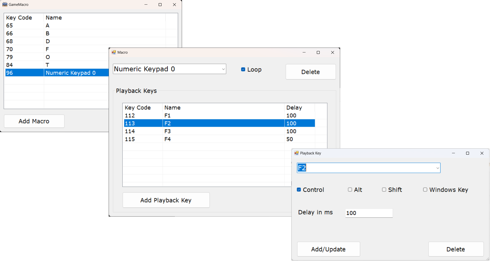

# 

# CS-1410 Finial Project

For my final project I will be combining my love of gaming with the object-oriented programming. GameMacro is application built for gaming and allows you to setup macro key that plays back keyboard & mouse events when a macro key is pressed.

## Features

-   Create multiple macros
-   Each macro can have multiple keyboard & mouse events
-   You can enter a delay (milli-seconds) between keyboard & mouse events
-   Macro can run once or be looped
-   Macros can be saved to disk

## Requirements

-   Runs on only ‘Windows 7’ – ‘Windows 11’
-   Require .NET Framework 4.8 (GUI written in C++ .NET CLI)

## Installation

### Binary Installation

Download the latest binary from the [Releases Page](https://github.com/smedlytonker/GameMacro/releases). It’s the easiest way to get started.

### From Source

-   You must have Visual Studio. Your installation of Visual Studio should have:
    -   MSVC v143 – VS 2002 C++ x64/x86 build tools
    -   MSVC v143 – VS 2022 build tools
    -   C++/CLI support for v143
-   In Visual Studio clone the project
-   Build the project
-   Place a copy of ‘Keys.ini’ that is part of the project in the executable folder. Program will shut down without a Keys.ini.
-   Launch MacroKeys.exe

## Screen Shots

