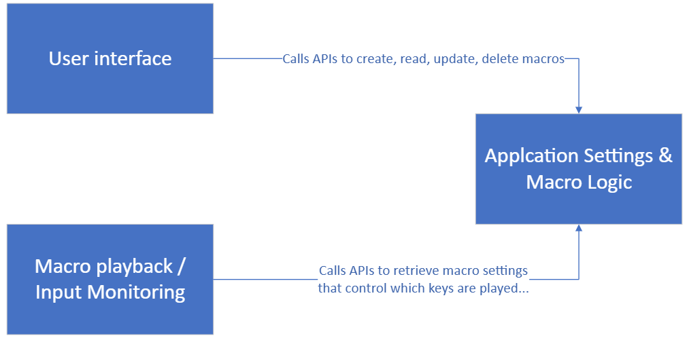

# CS-1410 Finial Project Software Documentation

The software can be divided into three major pieces:

1.  User interface
2.  Macro playback and Input monitoring
3.  Application Settings & Macro logic

Here is a diagram showing the relationship between the pieces

 
The ‘User Interface’ and the ‘Macro Playback’ blocks run on their own thread. Because they run on their own thread I had to use a mutex to protect access to data structures in ‘Applications Settings’ block.

## User interface – Viewing, searching & changing macro information
The GUI is written in C++ .NET CLI using WinForms. I looked at several options on how to implement a GUI. This including Text User Interface (TUI) like ncurses & FTXUI, but in the end the learning curve was lowest for WinForms. 

The code that was written by me is completely contained withing the event callbacks (button pushes, clicks, …). The GUI calls the APIs for the ‘Application Settings’ block to populate the three screens in in UI. The balance of the GUI code it auto generated from the GUI design wizard. This design wizard allows you to draw the GUI and set various properties like icon for the application, color, …

## Macro playback and Input monitoring
This block processes keyboard and mouse clicks and using information from the ‘Applications Settings’ determines if a macro needs to be played back and with which keyboard or mouse input.

## Application Settings & Logic
This is the most interesting block as it pertains to object-oriented programming. In this section I demonstrate the following OOP principles: 
-   Inheritance
-   Encapsulation
-   Polymorphism
-   Abstraction

This block of code is designed to provide the following functionalities:

-   Data back store for macro settings. Settings are stored to disk
-   APIs for create, read, update, delete macros

## Credits:
-   Microsoft WinForm: <https://www.youtube.com/watch?v=zv8DkkhBNR0>
-   SimpleIni: [brofield/simpleini: Cross-platform C++ library providing a simple API to read and write INI-style configuration files](https://github.com/brofield/simpleini)
-   Virtual key codes: <https://learn.microsoft.com/en-us/windows/win32/inputdev/virtual-key-codes>
-   Simulating keyboard input: [Simulate Keyboard In Games \| C++ Game Hacking](https://www.youtube.com/watch?v=L271J_lKyRA)
